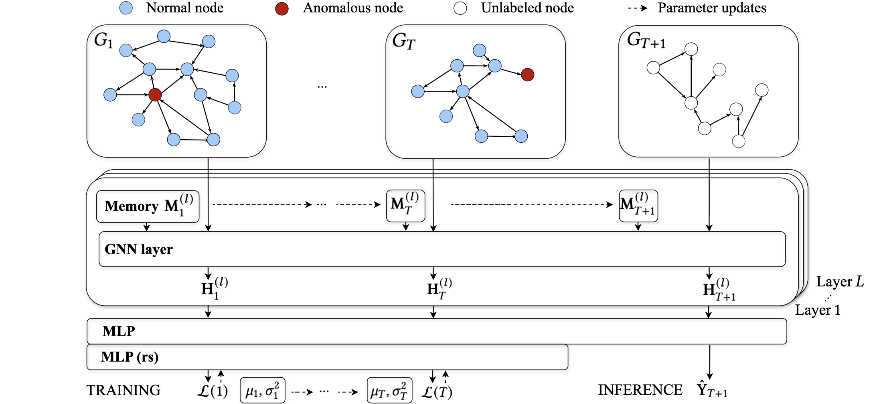

# HERDGNN



This repository contains the **official implementation** of the paper:

> **HERDGNN: Hybrid Error-Guided Regularization with Deviation for Imbalance Classification in Dynamic Graphs**


[//]: # (> Proceedings of the VLDB Endowment &#40;PVLDB&#41;)

  
HERDGNN is a **snapshot-based dynamic GNN** for rare abnormality/anomaly classification.  
It uses **constant-size hierarchical temporal memory** (no node-embedding cache) and a **deviation-aware loss**, enabling **scalable live-update training**.

---

## Overview

Real-world applications such as **financial fraud detection, anti-money laundering (AML), cybersecurity, and social platforms** generate large evolving graphs where anomalies are rare, labels are scarce, and models must be updated continuously.


## Key idea

Dynamic graphs in fraud/AML/cyber/social settings are large, evolving, and extremely imbalanced.  
HERDGNN tackles this by:
- maintaining a **fixed-size (graph-size-agnostic) per-layer memory**
- using a **deviation-aware objective** to push anomalies into the score tail
- training/evaluating under a **live-update protocol**

---

## Method Summary

HERDGNN consists of four key components:

1. **Snapshot-Based GNN Backbone**  
   Each snapshot is processed independently using a standard GNN (e.g., GIN, GCN, GAT).

2. **Hierarchical Temporal Memory**  
   Instead of caching node embeddings over time, the model maintains a **fixed-size, per-layer memory** that evolves across snapshots and modulates GNN parameters.  
   The memory footprint is **independent of the number of nodes, edges, and snapshots**.

3. **Deviation-Aware Anomaly Scoring**  
   Risk scores of normal entities are modeled using **online Gaussian statistics**.  
   A deviation loss pushes labeled anomalies into the upper tail of the score distribution while keeping normal entities near the mean.

4. **Live-Update Training Protocol**  
   The model is incrementally fine-tuned snapshot by snapshot, carrying forward only:


---

## Repository Structure

All implementations(HERDGNN and other baselines) follow a modular design (PyTorch Lightning).

**Core files**
- `Main entry script name (herdnet_main.py, roland_main.py,..)`  
  Entry point for running experiments (arg parsing, dataset/model setup, trainer launch).
- `lightning_module.py`  
  Training/validation/testing steps, loss computation, metrics, optimizer.
- `model.py`  
  GNN backbone, memory module, scoring head.

**Directories**
- `dataset/` : contain the scripts for preprocessing and preparing each dataset 
- `data/` : where raw/processed datasets are stored
- `experiments/` : Outputput of metrics for each methods save in this directory after directory

---

## Dataset Processing

The `dataset/` directory contains all preprocessing and data-loading code.

Processing includes:
- Transforming raw event streams into **discrete-time graph snapshots**
- Preparing data for training with PyTorch Geometric in DGNN setup

This design allows consistent evaluation across multiple datasets and tasks.
For some datasets you need manually download dataset and put them in `data/<dataset_name>/raw`.(like Elliptic++ and DGraphFin)

[RedditTitle](https://snap.stanford.edu/data/soc-RedditHyperlinks.html), [RedditBody](https://snap.stanford.edu/data/soc-RedditHyperlinks.html), [DGraphFin](https://dgraph.xinye.com), [Elliptic++](https://github.com/git-disl/EllipticPlusPlus), [EthereumPhishing](https://xblock.pro/ethereum#/search?types=datasets&tags=Transaction+Analysis), [SAML](www.kaggle.com/datasets/berkanoztas/synthetic-transaction-monitoring-dataset-aml/data?select=SAML-D.csv), [AMLWorld](https://www.kaggle.com/datasets/ealtman2019/ibm-transactions-for-anti-money-laundering-aml/data)

---

## Implemented Models

The repository includes:

- **HERDGNN** (proposed method)
- Temporal GNN baselines (ROLAND, WinGNN, HawkGNN) and their integration with deviation-loss

---

## Getting Started

### Prerequisites

- Python **3.11** or higher
- CUDA 12.1
- [Poetry](https://python-poetry.org/) for dependency management

---

### Installation

Clone the repository:

```bash
git clone https://github.com/fafal-abnir/HerdGNN.git
cd HERDGNN
```

Create and activate the virtual environment and install dependencies:
```bash
poetry install
poetry shell
pip install torch==2.4.0 torchvision==0.19.0 torchaudio==2.4.0 --index-url https://download.pytorch.org/whl/cu121
pip install pyg_lib torch_scatter torch_sparse torch_cluster torch_spline_conv -f https://data.pyg.org/whl/torch-2.4.0+cu121.html
pip install torch-geometric
pip3 install -r requirements.txt 
```
requirements.txt is included for convenience, allowing the project to be installed with pip or other virtual-environment tools. 
Poetry users should rely on `pyproject.toml` and `poetry.lock`

### Running Experiments
There are examples of commands for running each method on different dataset for example for running our method on Elliptic dataset:
```bash
python3 herdnet_main.py --epochs=200 --gnn_type=GIN --dataset_name=RedditTitle --graph_window_size=week --memory_size=192 --num_windows=178 --learning_rate=0.005 --alpha=0.1 --dropout=0.1 --blend_factor=0.9 --hidden_size=128 --enable_memory --force_reload_dataset;
```
note that `--force_reload_dataset` force to preprocess dataset again before running the experiment 